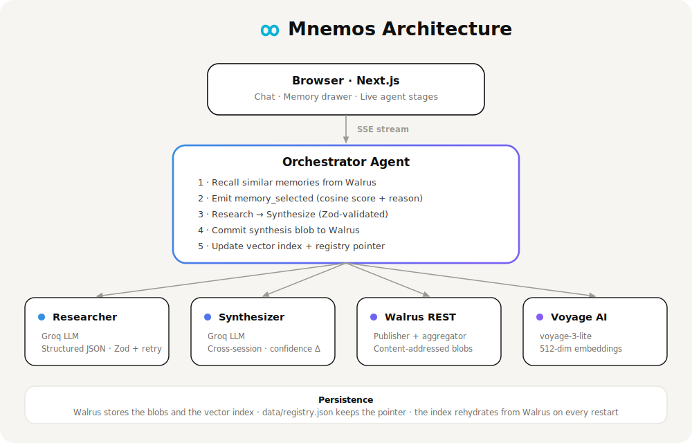

<div align="center">


# Mnemos

**A persistent AI memory engine — durable, verifiable memory powered by Walrus.**

[](https://nextjs.org)
[](https://typescriptlang.org)
[](https://walrus.xyz)
[](https://sui.io)

*Built for [Sui Overflow 2026](https://suioverflow.com) — Walrus Track*

</div>

---

## What is Mnemos?

AI agents are stateless. Every session starts from zero — the user becomes the memory layer, re-explaining context over and over. **Mnemos fixes this.**

Mnemos is a **workspace-based AI memory engine**: one workspace = one persistent, verifiable memory context (a dedicated "brain" for a purpose — e.g. CIRO crisis intelligence, research, cybersecurity). It is *not* a chatbot that stores every message. Each turn is triaged — casual chat gets a friendly reply and is ignored, real research runs a multi-agent pipeline — and a **memory curator** decides whether the result carries durable knowledge worth keeping. Only meaningful artifacts (decisions, research findings, preferences, plans) are stored as content-addressed blobs on [Walrus](https://walrus.xyz) (Sui's decentralized storage), scoped to the workspace, semantically indexed, and rehydrated on startup. **The engine gets smarter every session — without filling Walrus with chat spam.**

### Key Properties

- **Curated** — a memory-extraction step stores only durable knowledge; greetings, acknowledgements, and recall questions are skipped
- **Workspace-scoped** — every memory carries a `workspace_id`; retrieval is isolated per workspace, so contexts never leak
- **Persistent** — memory survives server restarts; the vector index lives on Walrus, not in RAM (single-retry on transient write failure)
- **Verifiable** — every memory blob has a public `blob_id` readable directly from the Walrus aggregator
- **Semantic** — retrieval is cosine similarity over Voyage AI embeddings, ranked by relevance · importance · recency · confidence
- **Explainable** — each retrieval emits a score, type, and plain-English reason in the live feed
- **Portable** — memory is user-owned; no lock-in to a single session or server

---

## Architecture

<div align="center">
  
</div>

### Memory Persistence Model

```
storeMemory()   (only runs when the curator says should_store)
  ├── embed summary+content  → Voyage AI (512-dim)
  ├── store memory blob      → Walrus (blob_id_A)   ← curated artifact + metadata
  ├── update VectorIndex     → Walrus (blob_id_B)   ← vector lives in the index
  └── write registry         → data/registry.json   ← pointer to blob_id_B
  (one automatic retry if a Walrus write transiently fails)

On server restart:
  loadIndex()
  ├── read registry.json     → blob_id_B
  └── fetch VectorIndex      → Walrus aggregator ✓
```

### Profile Memory Layer

Identity facts (name, role, education, tech stack, interests) must **never** depend on fuzzy vector search — names embed as near-noise and a write→immediate-read on Walrus testnet routinely misses. So Mnemos keeps a dedicated, deterministic **profile object** per `(user_id, workspace_id)`:

```
"<workspace>::<user>" → {
  profile: { name, role, education, interests[], tech_stack[], preferences[], facts[] },
  updated_at, source_blob_ids[]
}
```

- **Authoritative read path is local** (`data/profiles.json` + in-memory cache) → recall is instant and reliable, independent of testnet.
- **Mirrored to Walrus** each update (durable, verifiable), with a pointer in `data/profile-registry.json` for rehydration if the local store is lost.
- **Identity questions** ("who am I?", "what's my tech stack?") are answered **deterministically from the object** — never the LLM, so no hallucinated `"user"`.
- **`isValidName` guard**: `user`, `me`, `myself`, empty, etc. are rejected and can never be stored as a name; a valid name always overrides a bad one on merge.
- Profile facts are extracted by regex **before** the LLM curator, so the exact value (`Aura`, `Next.js`) is stored verbatim.

Lives in [`lib/profile/store.ts`](lib/profile/store.ts). Run the live validation suite: `node scripts/profile-test.mjs`.

---

## Agent Feed — Live SSE Events

| Event | Description |
|-------|-------------|
| `session_start` | New session opened (carries `workspace_id`) |
| `casual_reply` | Conversational / casual reply text (no pipeline) |
| `memory_loaded` | N prior blobs retrieved from the workspace |
| `memory_selected` | Per-blob: cosine score, type, importance, workspace, reason |
| `research_start` | Researcher agent begins (research lane only) |
| `research_complete` | N findings, confidence score |
| `synthesis_start` | Synthesizer cross-referencing sessions |
| `synthesis_complete` | Themes, confidence delta vs. prior sessions |
| `memory_decision` | Curator's structured store/skip decision |
| `memory_committing` | Writing to Walrus testnet |
| `walrus_retrying` | First write failed — retrying once |
| `memory_committed` | Blob ID confirmed on Walrus (+ type, importance) |
| `memory_skipped` | Nothing durable to store — reason given |
| `session_complete` | Duration, summary, reply mode, synthesis |

---

## Quick Start

**Prerequisites:** Node.js 18+, a free [Groq](https://console.groq.com) key, a free [Voyage AI](https://dashboard.voyageai.com) key.

```bash
git clone https://github.com/i-anasop/Engine.git
cd Engine
npm install
cp .env.local.example .env.local
# Add your GROQ_API_KEY and VOYAGE_API_KEY
npm run dev
```

Open [http://localhost:3000](http://localhost:3000).

---

## Environment Variables

Copy `.env.local.example` → `.env.local` and fill in your keys.

| Variable | Required | Source |
|----------|----------|--------|
| `GROQ_API_KEY` | ✅ Yes — free | [console.groq.com](https://console.groq.com) |
| `VOYAGE_API_KEY` | ✅ Yes — free tier | [dashboard.voyageai.com](https://dashboard.voyageai.com) |
| `WALRUS_PUBLISHER_URL` | Defaults to testnet | — |
| `WALRUS_AGGREGATOR_URL` | Defaults to testnet | — |
| `GEMINI_API_KEY` | Optional fallback LLM | [aistudio.google.com](https://aistudio.google.com/apikey) |
| `ANTHROPIC_API_KEY` | Optional fallback LLM | [console.anthropic.com](https://console.anthropic.com) |

**LLM priority order:** Groq → Gemini → Anthropic. Only one is needed. Groq is free and fastest.

> **Gemini note:** Use a key from a project *without* billing enabled — billing zeroes the free quota.

---

## Project Structure

```
mnemos/
├── app/
│   ├── api/
│   │   ├── agent/        # SSE orchestration endpoint
│   │   ├── diagnostic/   # Health check: LLM + Voyage + Walrus + index
│   │   ├── embed/        # Voyage AI embedding endpoint
│   │   └── memory/       # Blob list + blob content fetch
│   ├── workspace/        # Chat workspace (sidebar + multi-turn transcript)
│   └── page.tsx          # Landing page
├── components/
│   ├── agent/            # AgentFeed — live SSE event renderer
│   ├── memory/           # MemoryExplorer — blob list sidebar
│   └── workspace/        # QueryInput
├── lib/
│   ├── workspace.ts          # Workspace model (one workspace = one brain)
│   ├── agents/
│   │   ├── orchestrator.ts   # Triage → reply/research → decide → store + SSE
│   │   ├── responder.ts      # Memory-aware conversational reply
│   │   ├── memory-extractor.ts # Triage + memory curator (store/skip decision)
│   │   ├── researcher.ts     # Structured JSON reports (Zod-validated)
│   │   └── synthesizer.ts    # Cross-session synthesis + confidence delta
│   ├── profile/
│   │   └── store.ts          # Profile Memory Layer — deterministic identity object
│   ├── embeddings/
│   │   ├── voyage.ts         # Voyage AI REST client
│   │   └── search.ts         # Pure-JS cosine similarity + scored retrieval
│   ├── llm/
│   │   ├── index.ts          # Provider factory (priority fallback)
│   │   ├── groq.ts           # Groq — llama-3.1-8b-instant
│   │   ├── gemini.ts         # Gemini — gemini-2.0-flash
│   │   └── anthropic.ts      # Anthropic — claude-haiku-4-5
│   ├── walrus/
│   │   ├── client.ts         # REST wrapper: store, fetch, retry
│   │   └── memory.ts         # MemoryStore: index, persistence, registry
│   └── sui/
│       └── registry.ts       # Sui registry stub (Phase 2)
└── types/
    └── index.ts              # All shared TypeScript interfaces
```

---

## API Reference

### `POST /api/agent`
Runs the full research + memory workflow. Returns a Server-Sent Events stream.

**Request**
```json
{ "query": "string", "session_id": "string", "user_id": "string" }
```

**Response** — SSE stream of `AgentEvent` objects (see types above).

---

### `GET /api/memory?user_id=<id>&workspace_id=<id>`
Returns the memory list for a user, scoped to a workspace, rehydrated from Walrus on first call. Each item includes `memory_type`, `importance`, `summary`, and `workspace_id`.

---

### `POST /api/memory`
Fetches full blob content from the Walrus aggregator.
```json
{ "blob_id": "string" }
```

---

### `GET /api/diagnostic`
Parallel health check — LLM response, Voyage embedding, Walrus store+fetch round-trip, and memory index entry count. Returns `200 ready` or `503 not_ready`.

---

## Walrus Integration

All persistent data lives on Walrus testnet. Nothing is stored in a database.

| Data | Format | Written by |
|------|--------|-----------|
| Synthesis documents | JSON blob | After every session |
| Embedding vectors | Binary `Float32Array` | Per memory stored |
| Vector index snapshots | JSON blob | After every write |

Blob IDs are content-addressed — identical content returns the same ID. Every blob is publicly readable via the aggregator URL shown in the Memory Explorer.

**Testnet endpoints:**
- Publisher: `https://publisher.walrus-testnet.walrus.space`
- Aggregator: `https://aggregator.walrus-testnet.walrus.space`

---

## Tech Stack

| | Technology |
|-|-----------|
| Framework | Next.js 16, App Router |
| Language | TypeScript (strict mode) |
| Styling | Tailwind CSS v4 · Satoshi (display) · Geist Mono |
| Storage | Walrus (Sui decentralized blob storage) |
| Embeddings | Voyage AI `voyage-3-lite` — 512 dimensions |
| LLM | Groq / Gemini / Anthropic (pluggable) · 429 retry/backoff |
| Validation | Zod with retry on parse failure |
| Streaming | Server-Sent Events (SSE) |
| Blockchain | Sui (registry, Phase 2) |

---

## Scripts

```bash
npm run dev        # Development server (Turbopack)
npm run build      # Production build
npm run typecheck  # TypeScript check
npm run lint       # ESLint
```

---

## Security

- API keys are loaded server-side only — never exposed to the browser
- `.env.local` is gitignored; use `.env.local.example` as the setup template
- `data/registry.json` (local Walrus pointer) is gitignored — rebuilt automatically on startup
- Walrus blobs on testnet are public; do not store sensitive content

---

<div align="center">

Made by [Muhammad Anas](https://github.com/i-anasop) for Sui Overflow 2026

</div>
